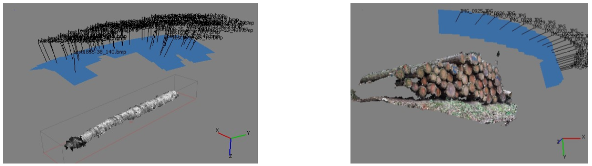
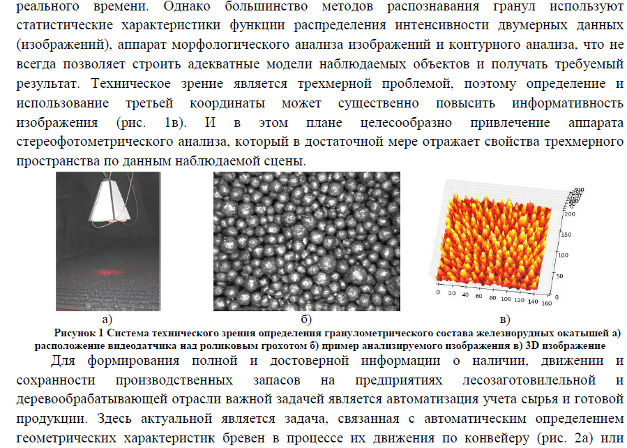
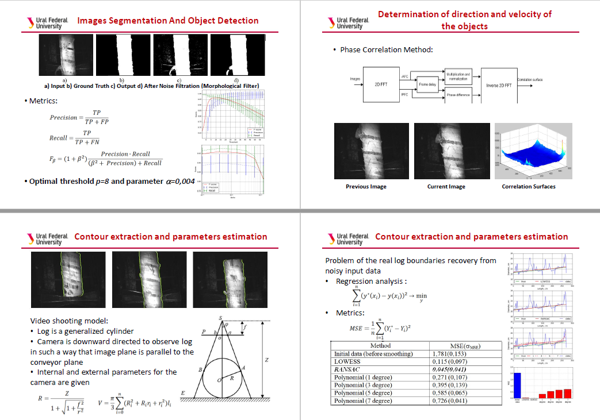
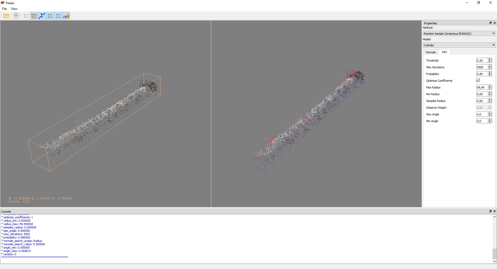
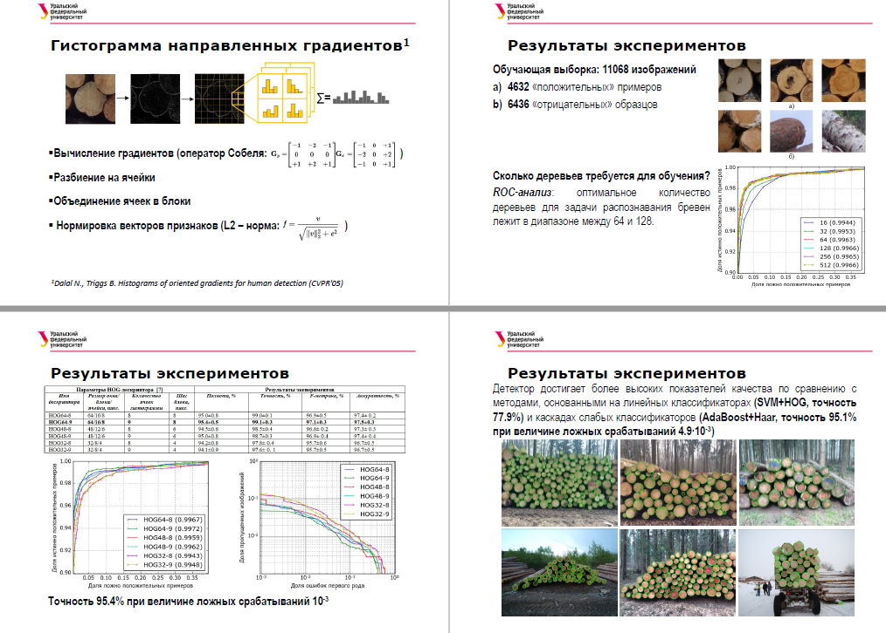

# Wood - бесконтактный контроль геометрических размеров лесоматериалов

## С++/QT проекты в рамках некоторых заявок/проектов/[публикаций](https://science.urfu.ru/ru/persons/юрий-владимирович-чирышев/publications/) посвященных дереву

1. [Развитие методов и средств построения 3D моделей наблюдаемых объектов применительно к задаче построения бесконтактных измерительных систем реального времени](application.pdf)

2. [Detection and Dimension of Moving Object by Using Single Camera Applied to the Round Timber Measurement](FedCSIS.pdf)

3. [Система построения трехмерных компьютерных моделей реальных объектов применительно к задачам объектов применительно к задачам бесконтактного определения геометрических размеров и форм объектов по изображениям или видеопоследовательностям](iurii.chiryshev.pdf)

4. [МЕТОД АВТОМАТИЧЕСКОГО ДЕТЕКТИРОВАНИЯ СРЕЗОВ БРЕВЕН ДЕТЕКТИРОВАНИЯ СРЕЗОВ БРЕВЕН С ПОМОЩЬЮ ОБУЧЕНИЯ СЛУЧАЙНЫХ РЕШАЮЩИХ ДЕРЕВЬЕВ И ГИСТОГРАММЫ ОРИЕНТИРОВАННЫХ ГРАДИЕНТОВ](round_wood.pdf)

__QT, Opencv, OpenSceneGraph (OSG), Point Cloud Library (PCL)__

[forest_research](https://github.com/iurii-chiryshev/forest_research)
